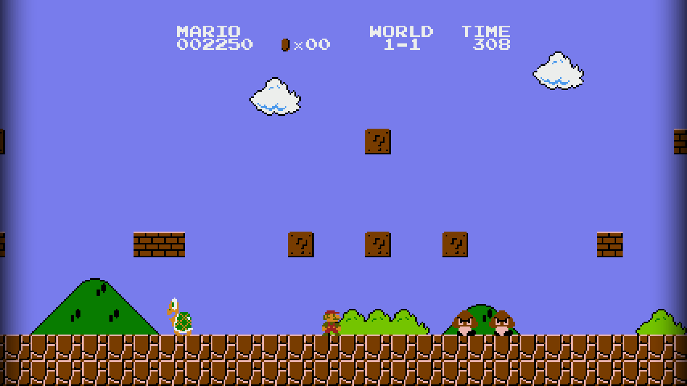

# SuperMarioBrosRecomp

Static recompilation of Super Mario Bros. (NES) for native PC.
Built with the [NESRecomp](https://github.com/mstan/nesrecomp) framework.

> **Status: Work in progress.** World 1-1 is fully playable and the title screen renders correctly. Known issues exist (see below) — this is an early release intended for testing and development.

## Known Issues

- **World 1-2 warp pipe crash** — entering the warp zone causes a game over; world transitions not fully implemented
- **Luigi frozen after Mario dies** — controller 2 input not yet bound; 2-player mode non-functional

## Quick Start

1. Download `SuperMarioBrosRecomp-windows-x64.zip` from [Releases](../../releases)
2. Extract and run `SuperMarioBrosRecomp.exe`
3. Select your Super Mario Bros. (World) ROM when prompted — the path is saved for future launches

## Widescreen (16:9)

The game launches in 16:9 widescreen by default. The extended viewport shows
upcoming terrain and enemies in the right margin using a runahead technique --
the game engine runs a second pass each frame with the camera shifted forward
to capture what's ahead.



Press **F8** to toggle between 4:3 (authentic) and 16:9 at any time.

**Known limitation**: Occasional sprite flickering may occur at the boundary
between the 4:3 viewport and the widescreen margin. This is cosmetic and does
not affect gameplay.

## Controls

| NES Button | Keyboard |
|------------|----------|
| D-Pad      | Arrow keys |
| A          | Z |
| B          | X |
| Start      | Enter |
| Select     | Right Shift |

## Hotkeys

| Key | Action |
|-----|--------|
| F5  | Toggle turbo (fast-forward) |
| F6  | Save state → `C:\temp\quicksave.sav` |
| F7  | Load state ← `C:\temp\quicksave.sav` |
| F8  | Toggle widescreen (4:3 / 16:9) |

## ROM

| Field | Value |
|-------|-------|
| Title | Super Mario Bros. (World) |
| CRC32 | `3337EC46` |
| MD5   | `811b027eaf99c2def7b933c5208636de` |
| SHA-1 | `ea343f4e445a9050d4b4fbac2c77d0693b1d0922` |

## Building from Source

Prerequisites: Windows 10+, Visual Studio 2022, CMake 3.20+ (SDL2 is bundled)

```
git clone --recurse-submodules https://github.com/mstan/SuperMarioBrosNESRecomp
cmake -S . -B build -G "Visual Studio 17 2022" -A x64
cmake --build build --config Release
```

## Architecture

This is a **static recompiler**, not an emulator. The 6502 machine code in the ROM
has been translated to C by [NESRecomp](nesrecomp/) and compiled to native x64.

| File | Purpose |
|------|---------|
| `extras.c` | SMB-specific runner hooks |
| `game.cfg` | Recompiler config (inline dispatch, NROM-256 layout) |
| `generated/super-mario-bros_full.c` | Recompiled 6502 code (committed) |
| `generated/super-mario-bros_dispatch.c` | Dispatch table (committed) |
| `ISSUES.md` | Detailed open issue tracker |
